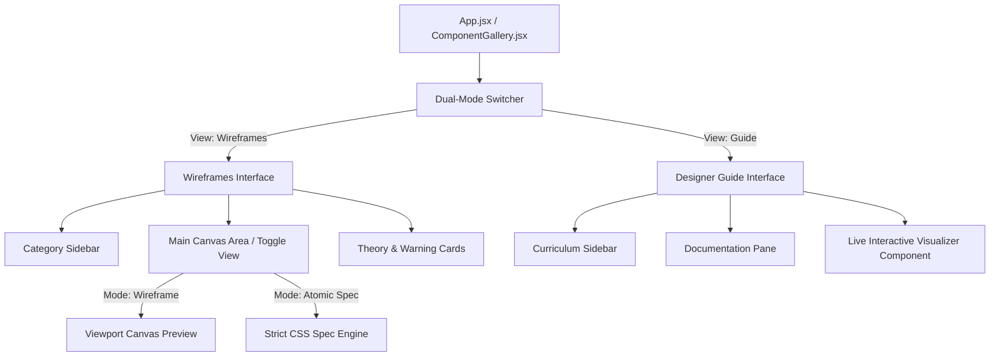

# UI Component Gallery (Wireframe Edition) — System Architecture & Component Guide

The **Ultimate UI Component Gallery (Wireframe Edition)** is an interactive, web-based pedagogical and prototyping tool designed to bridge the gap between design psychology, strict CSS layout rules, and code generation. 

By stripping away colors, styling, and photography, the tool allows designers, developers, and AI agents to focus entirely on visual hierarchy, layout mechanics (CSS Flexbox/Grid), and cognitive principles.

---

## 🏗️ Core Application Architecture

The application is structured as a single-page React app powered by **Tailwind CSS**, designed with a dual-mode workflow switcher:
1. **Wireframes Mode**: Visual sandbox showcasing interactive layouts inside mock browser/mobile viewports alongside their "Atomic Spec" CSS layouts, psychological theories ("The Why"), and implementation warnings.
2. **Designer Guide Mode**: A curriculum engine illustrating core design theories (Gestalt, responsive grids, spacing systems) equipped with custom, interactive live visualizers for real-time practice.

---

## 📦 System Modules & Components

The application's structural division is designed to keep data layers separated from visual rendering containers.

### 1. Main Stage Orchestrator: `ComponentGallery.jsx`
Located at `src/ComponentGallery.jsx`, this acts as the control center of the entire application.
* **State Management**: Controls global view mode (`'layouts'` vs `'guide'`), selected indices (`activeIndex`, `guideIndex`), and code view toggle (`showSpec`).
* **Sidebar System**: Groups wireframes and guide modules by dynamic categories (e.g., standard grids, unique sections, mobile layouts) for instant navigation.
* **Preview Canvas**: Embeds an animated browser chrome viewport wrapper and switches automatically to an styled mock **iPhone viewport** if a mobile layout is active.
* **Atomic Spec Renderer**: Renders strict alignment constraints, CSS rules, and DOM nesting depths for target layers in high-fidelity markdown blocks.

### 2. Structural Wireframe Bricks: `Wireframes.jsx`
Located at `src/components/Wireframes.jsx`, this contains modular elements for creating standard wireframes:
* `<WireHeading width="..." />`: Simulates prominent text/headers using sleek dark backgrounds.
* `<WireTextLine width="..." />`: Simulates paragraph elements.
* `<WireImage text="..." />`: Renders dashed-bordered containers to simulate placeholder graphic frames.
* `<WireButton />`: Renders neutral action buttons.
* `<MobileViewport />`: A state-of-the-art **iPhone simulation frame** equipped with status bars, a home indicator bar, and custom scrollbar tracking for high-fidelity responsive layout testing.

### 3. The Data Engine (`src/data/`)
This module organizes the library of layout organisms and pedagogical assets:

| File Name | Purpose | Layout Count / Categories Included |
| :--- | :--- | :--- |
| **`unique11.jsx`** | Layout strategies based on teardowns | 11 sections (e.g., *Product Orbit, Recursive Nesting, Peek-a-boo Slider*) |
| **`hero18.jsx`** | High-impact initial viewport configurations | 18 hero layouts (e.g., *Typography-Led, Video Modals, Classic Splits*) |
| **`grid33.jsx`** | Layout options for general content blocks | 33 standard layouts (e.g., *Asymmetric 2-Col, 6-Col Micro Grid*) |
| **`properLayout.jsx`** | Ready-made multi-block page structures | Standard page shells and flow components |
| **`mobileLayouts.jsx`** | Mobile-tailored viewport layouts | Exclusive mobile-first responsive organisms |
| **`designerGuide.jsx`** | Pedagogical syllabus database | Comprehensive theory cards mapped across **7 categories**: *The Why, The How, The What, The Workflow, The Proof, The Future, Mobile Strategy* |

---

## 🔬 Comparison: Workspace vs. GitHub Copies

A deep analysis reveals that the **active workspace** contains the fully realized v2.0 integration engine, whereas the copy located at `C:\Users\Diomedes Fernandez\.gemini\antigravity\scratch\OnGitHub\UI-gallery-main\UI-gallery-main` is an older, incomplete development branch.

### Missing Elements in the GitHub Copy:
1. **No Mobile Viewport Engines**: Completely lacks `src/data/mobileLayouts.jsx` and `all tables/mobile design.md`.
2. **Standard Guide Data**: The guide data in `designerGuide.jsx` is **less than half the size (40.9 KB vs 98.3 KB)**. It lacks trend-forward topics (modular systems, anti-design, playground integrations) and misses advanced interactive React components (like the Mouse 3D rotation card, the squint test filter, and the dynamic color distributor bars).
3. **Basic Wireframes**: `src/components/Wireframes.jsx` is highly simplified and lacks the high-fidelity iPhone simulation viewport `<MobileViewport />`.
